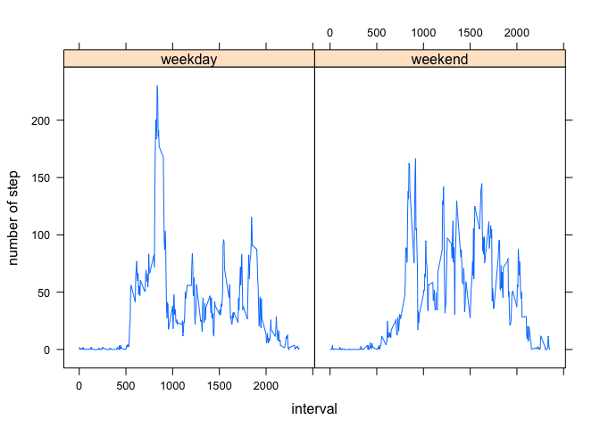

# Reproducible Research: Peer Assessment 1


## Loading and preprocessing the data

```r
data <- read.csv("activity.csv")
```


## What is mean total number of steps taken per day?


Histogram of all step taken per day:


```r
perday <- tapply(data$steps,data$date,sum)
hist(perday, xlab ="Steps taken per day",main="All steps taken per day",
     breaks =20)
```

 

```r
meanperday <- mean(perday,na.rm=TRUE)
medianperday <- median(perday,na.rm=TRUE)
```


The mean of number of steps taken per day is 1.0766 &times; 10<sup>4</sup>.
The median of number of steps taken per day is 10765.


## What is the average daily activity pattern?

Make a time series plot of the 5 min interval (x-axis) and average of number
of step taken averaged across all days (y-axis)


```r
perinterval <- tapply(data$steps,data$interval,mean,na.rm=TRUE)
plot(names(perinterval), perinterval, type = "l",
     xlab = "5 min interval", ylab = "average steps taken",
     main = "Average daily steps pattern")
```

 


It looks like the maximum is reached between 8 and 9 o'clock


```r
maxvalue <- max(perinterval)
maxinter <- as.integer(names(perinterval)[which.max(perinterval)])
beginint <- paste(maxinter%/%100,"h",maxinter-(maxinter%/%100)*100,"min")
endint <- paste(maxinter%/%100,"h",maxinter-(maxinter%/%100)*100 +5,"min")
```


The average daily steps reach the maximum value (206.1698) between 
8 h 35 min and 8 h 40 min 


## Inputing missing values
 
 Let's calculate and report the number of missing value
 

```r
ind <- is.na(data$steps)
num <- sum(ind)
```
 
 
 There are a total of 2304 missing values in the data set.
 Let's create newdata dataframe and fill the missing values using the mean accross days of
 that 5 min interval.
 

```r
perinterval <- tapply(data$steps,data$interval,mean,na.rm=TRUE)
newdata <- data
for (i in seq_along(newdata$steps)) {
                if (is.na(newdata$steps[i])) {
                x <- which(names(perinterval)==newdata$interval[i])
                newdata$steps[i] <- perinterval [x]
                                           }        
                                  }
```
 
Now let's make a histogram of total number of steps taken each day.


```r
newperday <- tapply(newdata$steps,newdata$date,sum)
hist(newperday, xlab ="Steps taken per day",
     main="All steps taken per day after inputting missing values",
     breaks = 20)
```

 

Let's calculate the mean and median steps taken per day


```r
newmeanperday <- mean(newperday)
newmedianperday <- median(newperday)
```


The mean of number of steps taken per day is 1.0766 &times; 10<sup>4</sup>.
The median of number of steps taken per day is 1.0766 &times; 10<sup>4</sup>.
So inputing the missing data does not change the mean and median significantly.


## Are there differences in activity patterns between weekdays and weekends?

Let's create another column called day


```r
newdata$day <- weekdays(as.Date(newdata$date))

weekenddays <- c("Saturday","Sunday")
weekdays <- c("Monday","Tuesday","Wednesday","Thursday","Friday")
inend <- newdata$day %in% weekenddays
inweek <- newdata$day %in% weekdays

newdata$day[inend] <- "weekend"
newdata$day[inweek] <- "weekday"
```


Let's graph the average number steps taken across all week days or 
all weekend days.


```r
newdata <- newdata[,c("day","interval","steps")]
newdata <- lapply(split(newdata,list(newdata$day,newdata$interval)),
                      function(x) {output <-x[1,];output[3]<-mean(x[,3]);output})
newdata<- do.call("rbind",newdata)

library(lattice)

xyplot(steps ~ interval | day, data = newdata,type = "l",
       ylab = "number of step")
```

 

We can see that there is the morning spike of steps for weekdays.
For weekends the distribution of steps seems to be smoother, which is intuitive,
assuming the subject works during weekdays, and has more free time during weekends.
